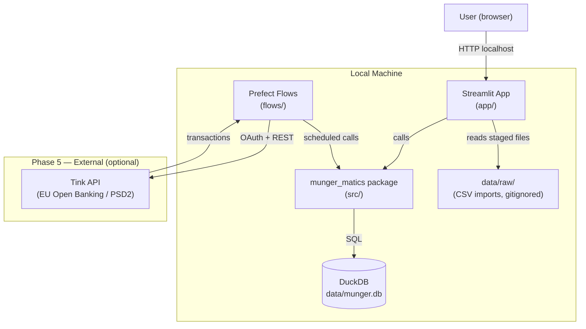
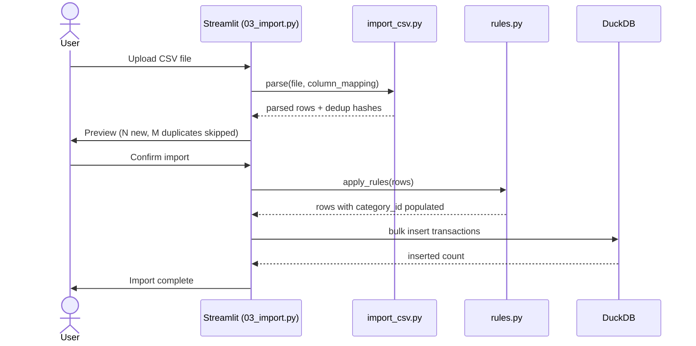

# Architecture

## System Overview

Munger-Matics is a single-user, self-hosted application. All data stays local. There is no
backend server, no cloud sync, and no external service calls except the optional EU open banking
integration in Phase 5.



---

## Layers

| Layer | Location | Responsibility |
|---|---|---|
| Presentation | `app/` + `app/pages/` | Streamlit UI only. Zero business logic. Calls `src/` functions and renders results. |
| Business logic | `src/munger_matics/` | All financial calculations, data transformations, import parsing, category rules |
| Data | `data/munger.db` | DuckDB persistent store. Gitignored. |
| Orchestration | `flows/` | Prefect flows for scheduled data pulls (Phase 5) |
| Config | `config/` | Committed business config (CSV column mappings, category seed data) |

**Architecture boundary rule:** `app/` imports from `src/`. `src/` never imports from `app/`. Neither imports from `notebooks/`. This is enforced by convention and checked in code review.

---

## Key Technology Decisions

### DuckDB as the database

DuckDB is an embedded OLAP database — it runs in-process, stores to a single file, and is
purpose-built for analytical queries over columnar data. For a personal finance app:

- No server to run or maintain
- Excellent performance for the queries this app needs (aggregations by month/category/account)
- First-class Python API
- Works natively with Polars DataFrames

The database file lives at `data/munger.db` (path configurable via `DATABASE_PATH` env var).
It is gitignored — it contains personal financial data.

### Polars for data transformations

All in-memory data manipulation uses Polars. It is:

- Significantly faster than pandas for the workload here
- Strictly typed — schema errors surface at build time, not runtime
- Directly interoperable with DuckDB

### Pydantic models at the domain boundary

Every entity that crosses the boundary between database and application logic is represented as a
Pydantic v2 model. This gives:

- Runtime validation on all data coming out of the DB
- A single source of truth for field types and constraints
- Clean separation between DB rows and domain objects

### Decimal for all monetary values

Financial amounts are stored in DuckDB as `DECIMAL(15,2)` and represented in Python as
`decimal.Decimal`. Floating-point arithmetic is never used for money. This follows standard
practice for financial software and prevents silent rounding errors.

### Sign convention

```
amount > 0  →  money flowing IN  (credit: salary received, investment gain)
amount < 0  →  money flowing OUT (debit: grocery purchase, rent payment)
```

This is applied consistently across all tables and all calculations.

---

## Source Module Structure

```
src/munger_matics/
  __init__.py
  database/
    __init__.py
    connection.py       # DuckDB connection context manager
    schema.py           # CREATE TABLE statements; initialise() called at startup
  accounts/
    __init__.py
    models.py           # Pydantic Account model
    repository.py       # CRUD: add, get, list, deactivate
  transactions/
    __init__.py
    models.py           # Pydantic Transaction model
    repository.py       # bulk insert, balance calculation, list with filters
    import_csv.py       # CSV parse, column normalisation, dedup hash generation
  categories/
    __init__.py
    models.py           # Pydantic Category model
    repository.py       # CRUD
    seed.py             # insert default two-level category hierarchy
    rules.py            # apply category_rules patterns to uncategorised transactions
  budgets/              # Phase 2
  planning/             # Phase 4
```

---

## App Page Structure

```
app/
  app.py                # entry point — sets page config, navigation
  pages/
    01_dashboard.py     # account balances, monthly income/expense, top categories
    02_accounts.py      # add/edit/deactivate accounts
    03_import.py        # CSV upload wizard (3-step)
    04_transactions.py  # full transaction ledger with inline category editing
    05_categories.py    # manage categories and auto-categorisation rules
```

---

## Data Flow: CSV Import



---

## EU Open Banking Integration (Phase 5)

The planned integration uses **Tink** (acquired by Visa), which provides:

- PSD2-compliant access to 3,400+ banks across 18 EU markets
- 95%+ coverage in major markets (Germany, France, Netherlands, etc.)
- Background refresh up to 4×/day without re-authentication
- Unified transaction format across all connected institutions

A Prefect flow in `flows/` will handle:
1. OAuth token refresh (Tink requires periodic re-auth per PSD2)
2. Scheduled daily transaction pull
3. Writing new transactions to DuckDB via the `transactions` repository
4. Flagging transactions that need category assignment

**Fallback:** Salt Edge (5,000+ banks, strong enrichment API) if Tink coverage is insufficient for
a specific institution.

---

## Configuration

| File | Purpose | Committed? |
|---|---|---|
| `config/csv_mappings.toml` | Column mapping presets per bank/institution | Yes |
| `config/categories.toml` | Seed category hierarchy | Yes |
| `.env` | `DATABASE_PATH`, API keys | No — gitignored |

Secrets (API keys, OAuth tokens) are never committed. They live in `.env` and are loaded via
`python-dotenv` at startup.
