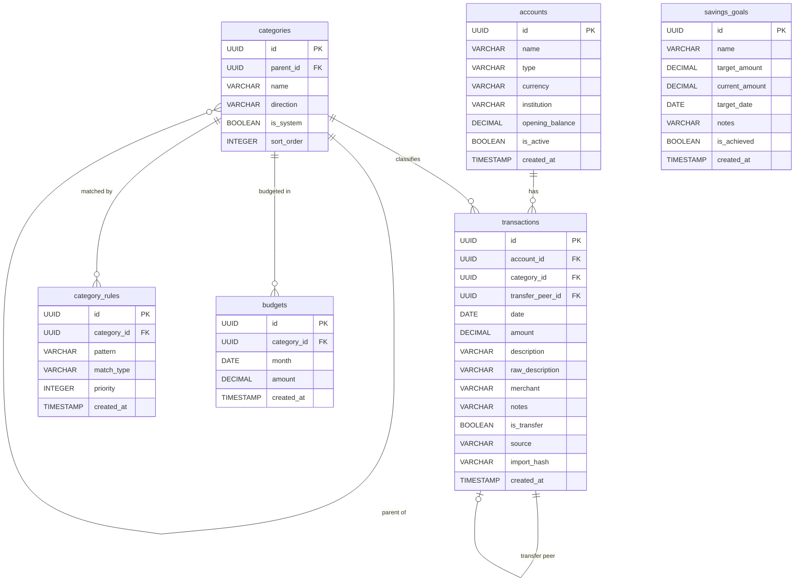

# Data Model

## Overview

The schema is designed for a single-user personal finance application backed by DuckDB. It covers
the full application lifecycle from Phase 1 through Phase 4. Tables introduced in later phases are
noted.

**Conventions across all tables:**

- Primary keys are UUIDs generated by DuckDB (`gen_random_uuid()`)
- Monetary amounts are `DECIMAL(15,2)` — never `FLOAT` or `DOUBLE`
- Sign convention: `amount > 0` = money in, `amount < 0` = money out
- `created_at` is set once at insert and never updated
- Soft deletes are preferred over hard deletes (use `is_active = false`)

---

## Entity-Relationship Diagram



---

## Table Definitions

### `accounts`

Each financial account the user holds. Balance is computed from `opening_balance` plus the sum of
all transaction amounts, not stored directly (avoids drift).

```sql
CREATE TABLE accounts (
    id              UUID         PRIMARY KEY DEFAULT gen_random_uuid(),
    name            VARCHAR      NOT NULL,
    type            VARCHAR      NOT NULL
                        CHECK (type IN (
                            'checking',     -- current / everyday account
                            'savings',      -- savings account
                            'investment',   -- brokerage / stocks
                            'retirement',   -- pension, provident fund
                            'credit_card',  -- revolving credit
                            'loan'          -- mortgage, personal loan
                        )),
    currency        VARCHAR(3)   NOT NULL DEFAULT 'EUR',
    institution     VARCHAR,                -- e.g. "ING", "DEGIRO", "NN Group"
    opening_balance DECIMAL(15,2) NOT NULL DEFAULT 0,
    is_active       BOOLEAN      NOT NULL DEFAULT true,
    created_at      TIMESTAMP    NOT NULL DEFAULT now()
);
```

**Balance calculation:**
```sql
SELECT
    a.id,
    a.name,
    a.opening_balance + COALESCE(SUM(t.amount), 0) AS current_balance
FROM accounts a
LEFT JOIN transactions t ON t.account_id = a.id
GROUP BY a.id, a.name, a.opening_balance;
```

---

### `categories`

Two-level hierarchy. Top-level categories have `parent_id = NULL`. Leaf categories reference a
top-level category via `parent_id`. Transactions are assigned to leaf categories only.

```sql
CREATE TABLE categories (
    id          UUID     PRIMARY KEY DEFAULT gen_random_uuid(),
    name        VARCHAR  NOT NULL,
    parent_id   UUID     REFERENCES categories(id),
    direction   VARCHAR  NOT NULL
                    CHECK (direction IN ('income', 'expense', 'transfer')),
    is_system   BOOLEAN  NOT NULL DEFAULT false,  -- system seeds vs user-created
    sort_order  INTEGER  NOT NULL DEFAULT 0
);
```

**Seed hierarchy (top-level):**

| Direction | Top-Level Category |
|---|---|
| income | Salary |
| income | Investment Income |
| income | Rental Income |
| income | Tax Refund |
| income | Other Income |
| expense | Housing |
| expense | Groceries |
| expense | Dining Out |
| expense | Transport |
| expense | Utilities |
| expense | Health |
| expense | Shopping |
| expense | Entertainment |
| expense | Subscriptions |
| expense | Education |
| expense | Insurance |
| expense | Fees & Charges |
| expense | Other |
| transfer | Transfer In |
| transfer | Transfer Out |

User-defined subcategories can be added under any top-level category. System categories
(`is_system = true`) cannot be deleted, only renamed.

---

### `transactions`

One row per financial transaction. The `import_hash` field enables safe re-import of the same CSV
— duplicate rows are silently skipped.

```sql
CREATE TABLE transactions (
    id               UUID         PRIMARY KEY DEFAULT gen_random_uuid(),
    account_id       UUID         NOT NULL REFERENCES accounts(id),
    date             DATE         NOT NULL,
    amount           DECIMAL(15,2) NOT NULL,  -- positive = credit, negative = debit
    description      VARCHAR      NOT NULL,   -- cleaned for display
    raw_description  VARCHAR,                 -- original text from bank
    merchant         VARCHAR,
    category_id      UUID         REFERENCES categories(id),
    notes            VARCHAR,
    is_transfer      BOOLEAN      NOT NULL DEFAULT false,
    transfer_peer_id UUID         REFERENCES transactions(id),
    source           VARCHAR      NOT NULL DEFAULT 'manual'
                         CHECK (source IN ('manual', 'csv_import', 'api')),
    import_hash      VARCHAR      UNIQUE,     -- prevents duplicate imports
    created_at       TIMESTAMP    NOT NULL DEFAULT now()
);
```

**Import hash construction:**

The hash is a SHA-256 digest of the concatenation of:
`account_id + date.isoformat() + str(amount) + raw_description`

This is deterministic — importing the same file twice produces identical hashes, so the second
import inserts zero rows.

**Transfer detection logic (applied post-import):**

A pair of transactions is flagged as a transfer when:
1. `amount` on one equals `−amount` on the other (same absolute value, opposite sign)
2. The two transactions are within 2 calendar days of each other
3. They belong to different accounts owned by the user

Both rows are updated: `is_transfer = true` and `transfer_peer_id` set to each other's `id`.
Transfers are excluded from income/expense aggregations.

---

### `category_rules`

Pattern-matching rules applied to `raw_description` (and optionally `merchant`) at import time.
The highest-priority matching rule wins. Rules can be created manually or learned from user
corrections.

```sql
CREATE TABLE category_rules (
    id          UUID     PRIMARY KEY DEFAULT gen_random_uuid(),
    pattern     VARCHAR  NOT NULL,
    match_type  VARCHAR  NOT NULL DEFAULT 'contains'
                    CHECK (match_type IN (
                        'contains',     -- case-insensitive substring match
                        'starts_with',  -- case-insensitive prefix match
                        'regex'         -- full Python regex
                    )),
    category_id UUID     NOT NULL REFERENCES categories(id),
    priority    INTEGER  NOT NULL DEFAULT 0,  -- higher value = higher priority
    created_at  TIMESTAMP NOT NULL DEFAULT now()
);
```

**Rule application order:** descending `priority`, then descending `created_at`. First match wins.

---

### `budgets`

Monthly budget envelopes. One row per (category, month) pair. The `month` column always stores
the first day of the month (e.g. `2025-03-01` for March 2025).

```sql
CREATE TABLE budgets (
    id          UUID         PRIMARY KEY DEFAULT gen_random_uuid(),
    category_id UUID         NOT NULL REFERENCES categories(id),
    month       DATE         NOT NULL,  -- always first day of month
    amount      DECIMAL(15,2) NOT NULL CHECK (amount > 0),
    created_at  TIMESTAMP    NOT NULL DEFAULT now(),
    UNIQUE (category_id, month)
);
```

*Phase 2 table — created in schema but unused until Phase 2 UI is built.*

---

### `savings_goals`

Savings targets with optional deadlines. Used in Phase 4 for the house deposit tracker and any
other named savings goal. `current_amount` is updated manually or derived from tagged transactions.

```sql
CREATE TABLE savings_goals (
    id              UUID         PRIMARY KEY DEFAULT gen_random_uuid(),
    name            VARCHAR      NOT NULL,        -- e.g. "House Deposit"
    target_amount   DECIMAL(15,2) NOT NULL CHECK (target_amount > 0),
    current_amount  DECIMAL(15,2) NOT NULL DEFAULT 0,
    target_date     DATE,
    notes           VARCHAR,
    is_achieved     BOOLEAN      NOT NULL DEFAULT false,
    created_at      TIMESTAMP    NOT NULL DEFAULT now()
);
```

*Phase 4 table — created in schema but unused until Phase 4 UI is built.*

---

## Schema Initialisation

All tables are created in `src/munger_matics/database/schema.py` via the `initialise(conn)`
function. It is called once at application startup and is idempotent (`CREATE TABLE IF NOT EXISTS`).

The category seed data is inserted by `src/munger_matics/categories/seed.py`, also idempotent —
it checks for existing system categories before inserting.
